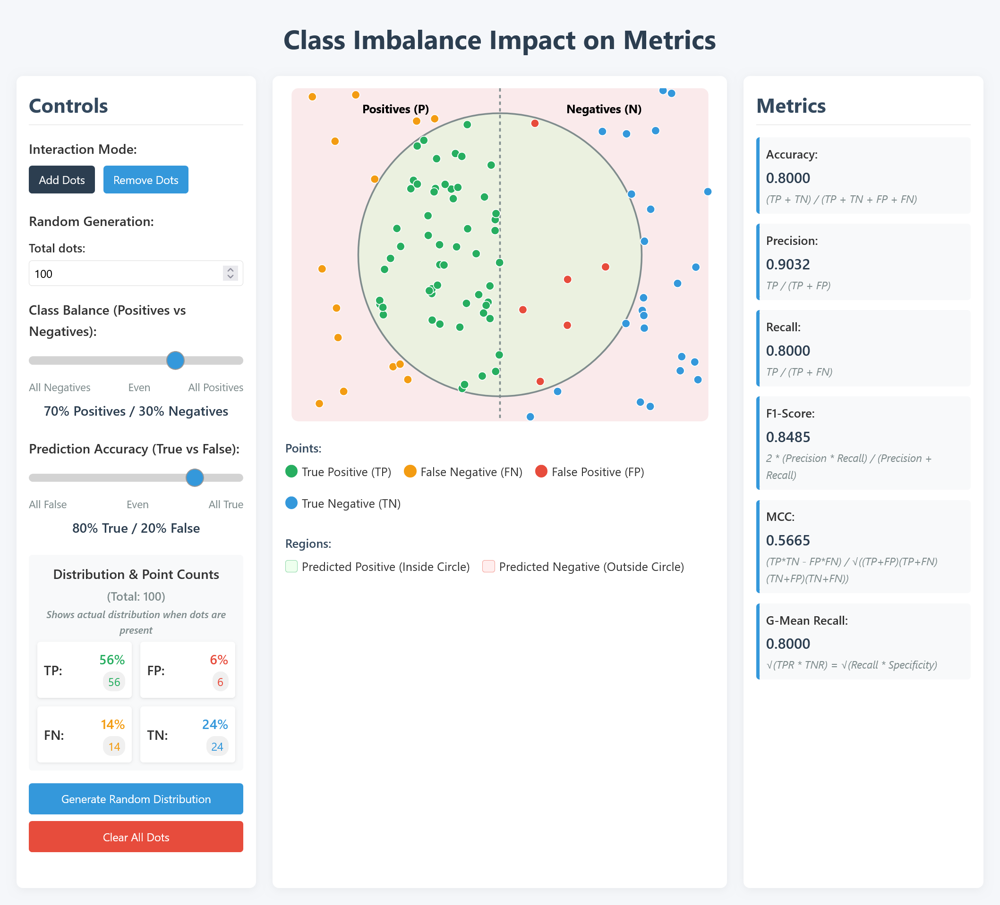

# Class Imbalance Impact Visualization

An interactive web-based tool for visualizing and understanding the impact of class imbalance on machine learning evaluation metrics.



## Overview

This project provides an intuitive visualization that demonstrates how different distributions of classes (imbalances) affect common machine learning evaluation metrics. It serves as an educational tool to help understand why certain metrics are more suitable than others when dealing with imbalanced datasets.

## Features

- **Interactive Data Manipulation**:
  - Add and remove individual data points
  - Adjust class balance with a slider (positives vs negatives)
  - Control prediction accuracy (true vs false)
  - Generate random distributions based on controlled parameters
  
- **Real-time Metric Calculation**:
  - Accuracy
  - Precision
  - Recall
  - F1-Score
  - Matthews Correlation Coefficient (MCC)
  - G-Mean Recall
  
- **Visual Classification Components**:
  - Confusion matrix representation (TP, FP, TN, FN)
  - Clear point classification with color coding
  - Visual separation of predicted positive/negative regions

## How to Use

1. Open `index.html` in a modern web browser
2. Use the controls to:
   - Switch between "Add Dots" and "Remove Dots" modes
   - Set the total number of dots
   - Adjust class balance and prediction accuracy
   - Generate random distribution or clear all dots
3. Observe how metrics change as you manipulate the data points
4. Use the visual representation and metrics to understand the impact of class imbalance

## Purpose

This visualization tool helps demonstrate why traditional accuracy can be misleading with imbalanced datasets, and shows the behavior of alternative metrics designed to better handle class imbalance.

## Technical Implementation

- Built with HTML, CSS, and JavaScript
- Uses D3.js for interactive data visualization
- Responsive design for use on various devices

## Getting Started

Simply clone this repository and open `index.html` in your browser - no server setup required.

```
git clone <repository-url>
cd visualisation
# Open index.html in your browser
```